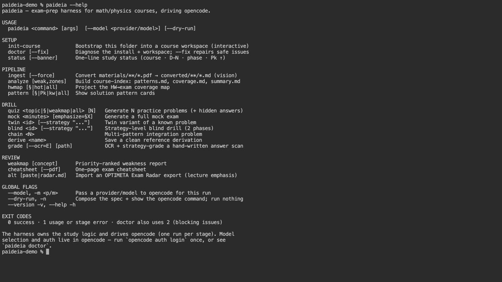
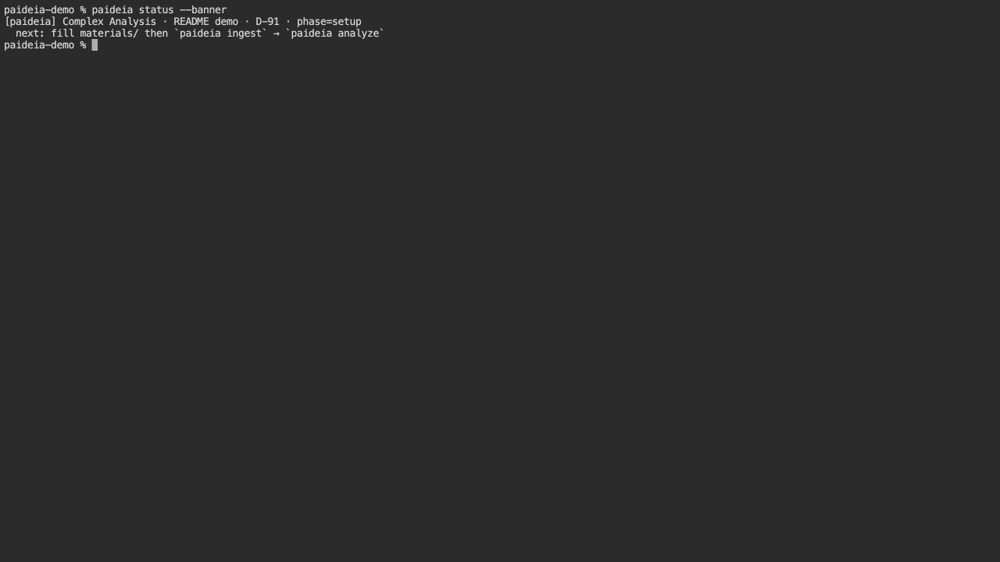
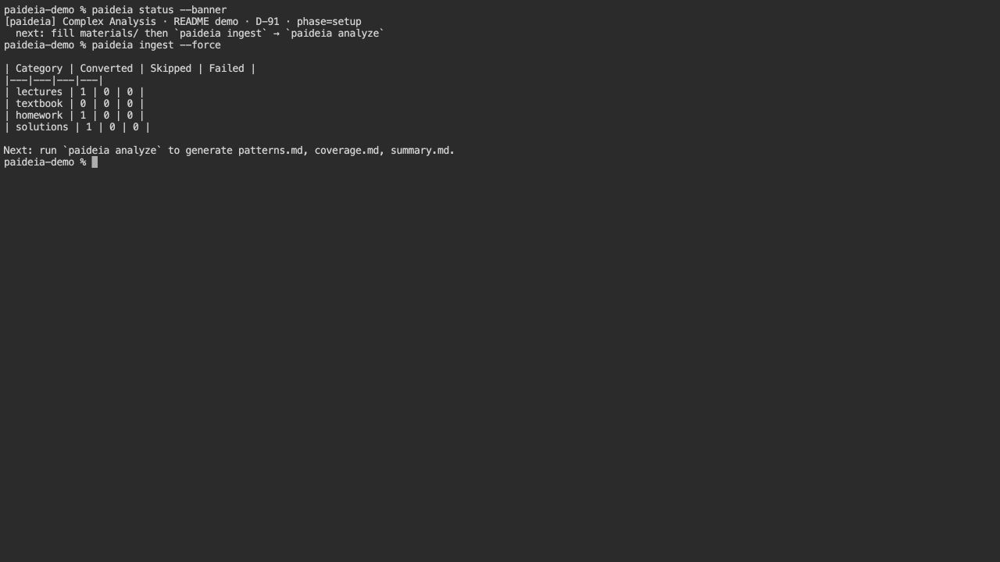
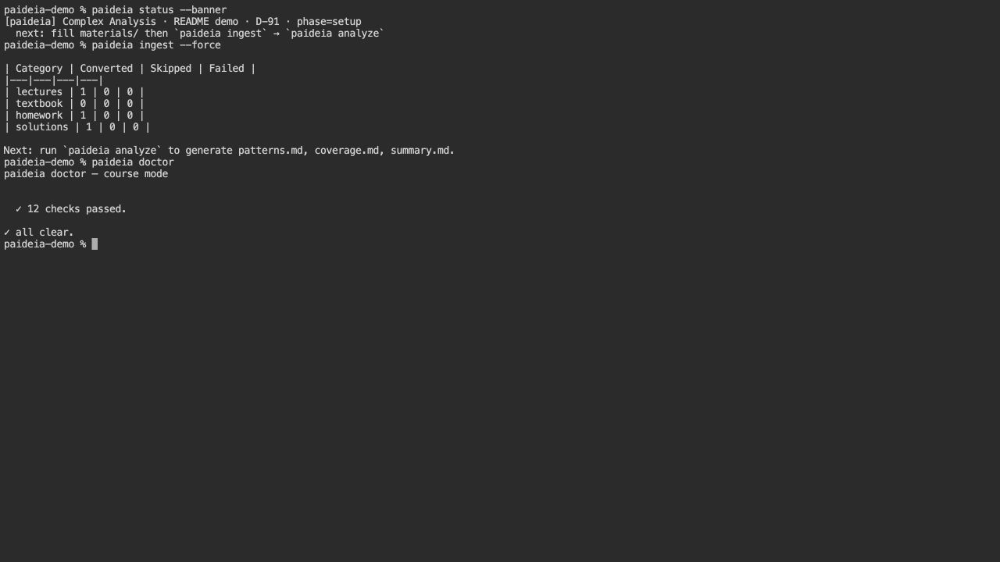

<h1 align="center">ΠΑΙΔΕΙΑ · Paideia <sub>for opencode</sub></h1>

<p align="center">
  <strong>Your course. Your patterns. Your errors. Your cheatsheet.</strong><br>
  <em>An opencode command-line harness that turns your own materials into a permanent, editable, per-course study graph — every artifact shaped by you, not by a generic syllabus.</em>
</p>

<p align="center">
  
  
  
  
  &nbsp;
  
  
  
  
  
  
  
  
  &nbsp;
  
  
</p>

<p align="center">
  <a href="https://news.hada.io/topic?id=29865"></a><a href="https://news.hada.io/weekly/202622"></a><br>
  <a href="https://www.producthunt.com/products/paideia"></a><a href="https://www.taewoopark.com/projects/paideia"></a>
  <br><sub>Original PAIDEIA coverage and interactive demo.</sub>
</p>

<p align="center">
  <a href="./README.ko.md">한국어 README</a>
  &nbsp;·&nbsp;
  <a href="https://taewoopark.com"><strong>taewoopark.com</strong> — author site</a>
</p>

<p align="center"><sub><strong>The PAIDEIA family — one study engine, every agentic runtime</strong></sub></p>

| Platform | Repository | What it is |
|:--:|:--|:--|
| <a href="https://github.com/OPTIMETA/PAIDEIA"></a> | **[PAIDEIA](https://github.com/OPTIMETA/PAIDEIA)** | The original — a **Claude Code** plugin. |
| <a href="https://github.com/OPTIMETA/PAIDEIA-codex"></a> | **[PAIDEIA-codex](https://github.com/OPTIMETA/PAIDEIA-codex)** | **OpenAI Codex** skills + bundled MCP server. |
| <a href="https://github.com/OPTIMETA/PAIDEIA-opencode"></a> | **[PAIDEIA-opencode](https://github.com/OPTIMETA/PAIDEIA-opencode)** | Command-line harness driving **opencode**. |
| <a href="https://github.com/OPTIMETA/PAIDEIA-Hermes"></a> | **[PAIDEIA-Hermes](https://github.com/OPTIMETA/PAIDEIA-Hermes)** | **Hermes Agent** plugin: CLI commands + gateway routing. |
| <a href="https://github.com/OPTIMETA/PAIDEIA-mcp"></a> | **[PAIDEIA-mcp](https://github.com/OPTIMETA/PAIDEIA-mcp)** | Standalone local **MCP** server — drive PAIDEIA from Alt local models. |
| <a href="https://github.com/OPTIMETA/PAIDEIA-Alt"></a> | **[PAIDEIA-Alt](https://github.com/OPTIMETA/PAIDEIA-Alt)** | **Exam Radar** — the Alt lecture-capture plugin ([altalt.org](https://altalt.org)). |

<p align="center">
  <em>Generic study tools teach you the average syllabus. Paideia teaches you <strong>your</strong> syllabus —<br>
  from your professor's notes, your HW emphases, your handwriting, your errors. Every artifact is a markdown file you can edit.</em>
</p>

<p align="center">
  
</p>

---

## What Paideia means

In ancient Greece, **Παιδεία** was never the deposit of facts into a passive student. It was the lifelong formation of a complete human being — through structured encounter with primary texts, guided practice under a master, and reflective dialogue that folds feedback into deeper revision.

This harness implements that cycle for the specific, bounded problem of **exam preparation** in math, physics, and engineering courses:

```
  ingest ──▶ analyze ──▶ drill ──▶ grade ──▶ weakmap ──▶ cheatsheet
     ▲                                                        │
     └────────────────── feedback loop ───────────────────────┘
```

The study stages save Markdown artifacts in your course folder. You can keep reading, editing, and versioning those files independently of the agent. Generating new artifacts still requires the runtime, tools, and model used by the chosen stage.

---

## What generic study tools can't do

Paideia starts with *your* course, *your* professor's assignments, and *your* mistakes. The input is the folder you bring: lecture notes, textbook chapters, homework, solutions, and scanned attempts.

Generic curricula and manually curated flashcards can be useful companions. Paideia adds a specific workflow: extract recurring moves from your solutions, rank practice by homework coverage, and feed recorded errors into the next drill. The table describes that workflow, rather than the features or subscription terms of every learning service.

| Axis | Paideia | A generic course or an unstructured chat |
|-----|---------|------------------------------|
| Solution patterns (`P1..Pk`) | Extracted from your course's solutions, with source citations | Requires course-specific material and instructions |
| Drill priority | Weighted by your professor's HW emphasis | Must be selected and maintained separately |
| Cheatsheet | Errors shape the traps section; the course index supplies references | Must be assembled and revised separately |
| Per-course state across sessions | Markdown + metadata files in the course folder | Depends on the service and how context is supplied |
| Editing an artifact you disagree with | Open the `.md` in any editor and save | Depends on the tool's editing and export support |
| Carrying prep into another semester | Copy the course folder and revise the changed material | Requires moving the relevant material and history |
| Version history of your understanding | `git log` / `git diff`, when you commit the files | Depends on the tool's versioning support |
| Where the artifacts live | Your disk, as text | Depends on the service |

The runner does the model work; the study graph remains yours to open, read, edit, and diff. Changing providers or pausing a subscription does not remove the files already produced.

Default answer OCR is `vision`: page images are read through the runner's vision path. For local answer OCR, install Ollama and `qwen3-vl:8b`, then explicitly select `OCR_ENGINE: ollama` in `.course-meta` or pass `--ocr=ollama` to grade. Downloading the model alone does not change the engine. `tesseract` is the other local option. Local OCR keeps that transcription step local; subsequent analysis and grading still use the configured model and may send it the transcribed text.

---

## The load-bearing principle: HW density = exam probability

Homework is Paideia's primary signal for allocating exam-prep time. Sections with more assigned problems get more practice; sections without homework remain reference material by default. **These are study-priority tiers, not measured probabilities or a guarantee of what the professor will test.**

| Tier | HW count on section | Treatment | Target share of mock-exam points |
|------|---------------------|-----------|---------------------------------|
| 🔥🔥 Exam-primary | 3+ | Drill hardest | ≥70% |
| 🔥 Exam-likely | 2 | Drill next | ~25% |
| 🟡 Exam-possible | 1 | Warm-pass review | ≤5% |
| ⚪ Low-risk | 0 | Reference only | 0 by default |

`paideia quiz all`, `paideia mock 90`, and `paideia hwmap hot` use this ranking. These allocations are instructions to the generating agent; inspect the resulting mock before relying on its exact distribution. Explicit requests and imported Exam Radar signals can inform what you choose to review.

---

## The formation cycle, stage by stage

<p align="center"><sub><em>Actual macOS CLI sessions, viewed through a local terminal viewer. The course uses small synthetic demonstration materials.</em> · <a href="docs/media/README.md">Capture notes</a></sub></p>
<table>
  <tr>
    <td align="center" width="50%">
      
      <br><sub><b><code>paideia status</code></b> — course · D-N · phase</sub>
    </td>
    <td align="center" width="50%">
      
      <br><sub><b><code>paideia --help</code></b> — command reference</sub>
    </td>
  </tr>
  <tr>
    <td align="center" width="50%">
      
      <br><sub><b><code>paideia ingest</code></b> — Markdown ingest</sub>
    </td>
    <td align="center" width="50%">
      
      <br><sub><b><code>paideia doctor</code></b> — dependency check</sub>
    </td>
  </tr>
</table>

Run **`paideia <command>` in your shell**. This edition is a standalone Node.js harness: it prepares files and a stage specification, then starts `opencode run` for the model work. It supplies 17 commands including `status`; `init` aliases `init-course`.

Setup, diagnostics, status, and Markdown copy-through run locally. Model stages are separate CLI invocations. For a two-step blind/twin exercise, submit your approach with `paideia blind <id> --strategy "…"` or `paideia twin <id> --strategy "…"`; there is no persistent PAIDEIA chat awaiting the reply. Read generated math in Obsidian.

| Stage | What it does | Commands | Produces |
|-------|-------------|----------|----------|
| **Encounter** | Read the professor's signal | `paideia ingest` | `converted/**/*.md` — every lecture, textbook chapter, HW, solution, as clean markdown |
| **Structure** | Extract the grammar of the course | `paideia analyze` | `course-index/{summary,patterns,coverage}.md` — topic tree, recurring solution patterns (P1..Pk), HW-density exam-tier ranking |
| **Practice** | Active recall weighted by assigned homework | `paideia quiz`, `paideia twin`, `paideia blind`, `paideia chain`, `paideia mock` | `quizzes/`, `twins/`, `chain/`, `mock/` — problems you solve on paper |
| **Reflection** | Your hand-written work becomes a grade | `paideia grade` | `answers/converted/<name>.md` + `errors/log.md` — OCR via agent vision (default), Ollama/Qwen3-VL, or Tesseract; then strategy-based grading |
| **Diagnosis** | Errors compressed into a priority-ranked weakness report | `paideia weakmap` | `weakmap/weakmap_<ts>.md` — append-only history |
| **Distillation** | One page, error-driven, printable | `paideia cheatsheet`, `paideia derive`, `paideia pattern` | `cheatsheet/final.md`, `derivations/<slug>.md` — reference only what you actually need |

Supporting: `paideia hwmap` shows homework-based study priorities, `paideia status` shows where you are in the cycle, and `paideia init-course` bootstraps a fresh course folder.

---

## Install

### Prerequisites

**Required**

- **Node ≥ 18.17** (runs the harness — plain ESM, zero runtime dependencies)
- **[opencode](https://opencode.ai)** (the execution engine) — `npm i -g opencode-ai`, then `opencode auth login` once
- **Python 3.9+** with `pdf2image` + `pillow` for rendering. In the Python environment used by PAIDEIA, run `python3 -m pip install pdf2image pillow`; add `pytesseract` for local Tesseract/fallback and `reportlab` for the fallback PDF exporter. Use `PAIDEIA_PYTHON` to select a virtual environment’s interpreter.
- A Unix-style shell (`bash` / `zsh`). On Windows use [WSL2](https://learn.microsoft.com/windows/wsl/install).
- **macOS**: `brew install poppler tesseract tesseract-lang`
- **Linux (Debian/Ubuntu)**: `apt-get install poppler-utils tesseract-ocr tesseract-ocr-kor`

**Optional — only for the `--ocr=ollama` mode (every page image stays on your machine)**

- `ollama` + the `qwen3-vl:8b` model (~6 GB). `brew install ollama && ollama pull qwen3-vl:8b`.

The default answer OCR is `vision`; it requires the rendering dependencies above and a working vision-capable opencode model. Selecting `ollama` requires a running local Ollama server. Downloading the model alone does not switch the engine.

### Install the harness

```bash
git clone https://github.com/OPTIMETA/PAIDEIA-opencode
cd PAIDEIA-opencode
npm link          # or: npm i -g .   → puts `paideia` on your PATH
paideia doctor    # verify your install (opencode, python, poppler, tesseract)
```

No build step. You can also run it directly: `node /path/to/PAIDEIA-opencode/bin/paideia.mjs …`.

### Per-course bootstrap

Open a terminal inside the folder you want to use for this course, then run:

```bash
paideia init-course
```

This interactively:

1. Asks which interface language you want for this course — `en` (default) or `ko`. All subsequent prompts, drill instructions, and generated MD narrative follow that choice. Structural tokens (file paths, command names, pattern IDs `P1, P2, …`, YAML keys, tier markers) stay in English regardless.
2. Asks which OCR engine you want as default: `vision` (agent vision), `ollama` (local Qwen3-VL), or `tesseract`.
3. Asks for `COURSE_NAME`, `EXAM_DATE`, `EXAM_TYPE`, `USER_WEAK_ZONES`.
4. Creates the directory skeleton (`materials/`, `converted/`, `course-index/`, `quizzes/`, `mock/`, `twins/`, `chain/`, `derivations/`, `cheatsheet/`, `weakmap/`, `answers/converted/`, `errors/`).
5. Writes `.course-meta` (carries `INTERFACE_LANG` + `OCR_ENGINE`, read by every command and by `vision_ocr.py`), an `AGENTS.md` course-context file, and an `opencode.json` whose `instructions` key loads `AGENTS.md` into every run in the folder.
6. Adds course ignore rules. If there is no `.git` in the course folder, runs `git init`, stages files, and attempts an initial commit; existing repositories are not auto-committed. Commit later changes yourself.

Override the OCR engine for a single grade call anytime: `paideia grade --ocr=vision path/to/answer.pdf`.

### Existing course folders (migration note)

A course without `INTERFACE_LANG` is treated as `en`; add `INTERFACE_LANG: ko` for Korean narrative. When moving from another edition, also review `AGENTS.md`, `opencode.json`, and the OCR engine: Codex’s `codex-native` corresponds to `vision`, and `qwen3-vl` to `ollama`. `init-course` leaves an existing `.course-meta` course alone unless `--force` is set. Forced bootstrap rewrites metadata, backs up a changed `AGENTS.md` to `.bak`, and preserves an existing `opencode.json`. Keep personal history and edited artifacts.

---

## Course folder layout

After `paideia init-course`, your course folder looks like this:

```
my-course/
├── .course-meta                     # course name, exam date, interface language (en|ko), OCR engine
├── AGENTS.md                        # course context opencode loads every run (via opencode.json)
├── opencode.json                    # instructions: ["AGENTS.md"] + permissions for unattended runs
├── .gitignore                       # hides raw PDF scans + OCR scratch; the study graph itself stays committed
│
├── materials/                       # YOU DROP RAW FILES HERE (PDF or MD)
│   ├── lectures/                    # professor's notes, slide decks
│   ├── textbook/                    # textbook chapters
│   ├── homework/                    # HW problem sets
│   └── solutions/                   # HW solutions / worked examples
│
├── converted/                       # generated Markdown — back up edits before re-ingest
│   ├── lectures/                    # output of `paideia ingest` (vision-transcribed LaTeX)
│   ├── textbook/  homework/  solutions/
│
├── course-index/                    # knowledge base — built by `paideia analyze`
│   ├── summary.md                   # topic tree (§1, §1.1, §2, …)
│   ├── patterns.md                  # recurring solution patterns, labeled P1, P2, …
│   ├── coverage.md                  # HW ↔ § map with 🔥🔥 / 🔥 / 🟡 / ⚪ exam tiers
│   └── radar.md                     # lecture-emphasis signal — imported by `paideia alt`
│
├── answers/                         # YOU DROP HAND-WRITTEN SCAN PDFs HERE
│   └── converted/                   # `paideia grade` writes OCR'd markdown here
│
├── errors/log.md                    # append-only YAML error log (seed for weakmap + cheatsheet)
│
├── quizzes/  mock/  twins/  chain/  # generated problems (each with hidden answer/solution siblings)
├── derivations/  cheatsheet/        # `paideia derive` / `paideia cheatsheet`
├── weakmap/                         # `paideia weakmap` — timestamped, append-only history
└── .paideia/run/                    # the composed stage specs handed to opencode (one per run)
```


Drop source files in `materials/` and answer scans in `answers/`. All Markdown artifacts are editable; generation can overwrite derived files, so commit edits you want to preserve. Keep `errors/log.md` and the weakmap history: they record personal attempts that cannot be reconstructed from the source PDFs alone. Runtime context files and OCR engine names differ between editions; see the migration FAQ.

---

## A reading tip: use Obsidian

Paideia writes everything as plain markdown with LaTeX math (`$...$`, `$$...$$`); you can read it in any editor, but **[Obsidian](https://obsidian.md)** is the natural choice:

- Renders `$...$` / `$$...$$` math via MathJax with zero configuration
- Backlinks let you click from `quizzes/q_<ts>.md` straight into the cited `converted/lectures/chN.md §K`
- The whole course folder is just a vault — point Obsidian at `~/courses/my-course`
- Entirely offline, free, local. Consistent with Paideia's philosophy: your notes, your disk, your tool

The terminal — even with a markdown preview — is bad for math; don't fight that.

---

## And the lecture end: Alt

Obsidian is the companion at the reading end. **[Alt](https://www.altalt.io/ko/)** is the companion at the other end — where the lectures come in. Alt records and transcribes your lectures, and OPTIMETA's **Exam Radar** plugin runs inside it to rank topics by how strongly the professor emphasized them out loud. Send that into Paideia with `paideia alt`, and the loop closes: **attend the lecture → capture it → extract the exam signal → study what matters.**

---

## Full workflow — an example

### Phase 0 — once per course (15 minutes)

```bash
cp ~/textbooks/ch*.pdf      ~/courses/my-course/materials/textbook/
cp ~/lecture-notes/wk*.pdf  ~/courses/my-course/materials/lectures/
cp ~/hw/hw*.pdf             ~/courses/my-course/materials/homework/
cp ~/hw/hw*_sol.pdf         ~/courses/my-course/materials/solutions/

paideia ingest                     # every PDF → vision pipeline (parallel subagents, LaTeX-faithful)
paideia analyze "weak-zone hints"  # build patterns + coverage + summary
paideia hwmap hot                  # surface 🔥🔥 exam-primary zones
```

### Phase 1 — diagnostic (40 minutes)

```bash
paideia quiz all 20                # broad diagnostic, 20 problems
# solve on paper (40 min), scan to answers/diagnostic.pdf
paideia grade                      # OCR + strategy grade
```

### Phase 2 — targeted drilling (bulk of your prep time)

```bash
paideia weakmap                    # priority-ranked weakness report
paideia blind hw3-p2               # strategy-only drill on a known problem
paideia blind hw3-p2 --strategy "residue theorem (P7), contour fixed, expect 2πi·Σ residues"
paideia twin hw3-p2                # variant with same pattern, new surface
paideia chain 3                    # multi-pattern integration problem
paideia quiz weakmap 5             # 5 problems targeting the latest weakmap
```

### Phase 3 — integration (~90 minutes)

```bash
paideia mock 90                    # full 90-min mock weighted by HW density
# solve on paper, scan, upload to answers/mock_<ts>.pdf
paideia grade                      # grade the mock
```

### Phase 4 — compression (60 minutes, night before exam)

```bash
paideia cheatsheet --pdf           # error-driven one-pager
paideia weakmap                    # review weak zones one more time
```

### Phase 5 — cool-down (10 minutes before exam)

```bash
paideia weakmap                    # top 3 only. Do not learn new things.
```

---

## Commands (17 total)

This is the installed command inventory for this edition; `init` is an alias for `init-course`. It does not include the original's `reindex` or `graph` commands.

| Command | Purpose |
|---------|---------|
| `paideia init-course` | Bootstrap a fresh course folder (interactive: language, OCR engine, metadata, skeleton, git) |
| `paideia doctor [--fix]` | Diagnose the install + workspace (opencode + auth, Python, poppler, tesseract, Ollama/Qwen3-VL, course folders, `.course-meta`, writable paths); `--fix` repairs the permission-free issues |
| `paideia status [--banner]` | Where you are in the cycle: `paideia · <COURSE> · D-N · <phase> · P<k> ↑` |
| `paideia ingest [--force]` | Every PDF in `materials/**` → markdown in `converted/**` via the vision pipeline (one subagent per PDF, LaTeX-faithful) |
| `paideia analyze [hints]` | Build `course-index/{summary,patterns,coverage}.md` |
| `paideia hwmap hot\|<§>` | Surface 🔥🔥 Exam-primary sections ranked by HW density |
| `paideia pattern <§\|Pk\|keyword>` | Show pattern cards from course-index |
| `paideia derive <target>` | Clean reference derivation to `derivations/<slug>.md` |
| `paideia quiz <topic\|§\|weakmap> [N]` | N practice problems, answers hidden in sibling `_answers.md` |
| `paideia blind <id> [--strategy "…"]` | Strategy-check drill on a known problem (present, then grade the strategy) |
| `paideia twin <id> [--strategy "…"]` | Variant of a known problem — same pattern, new surface |
| `paideia chain <N>` | Multi-pattern integration problem combining N patterns |
| `paideia mock <minutes>` | Full mock exam, HW-density weighted |
| `paideia grade [--ocr=<engine>] [path]` | OCR answer PDF via the engine set in `.course-meta` (agent vision / Ollama / Tesseract), strategy-grade, append `errors/log.md` |
| `paideia weakmap [concept]` | Priority-ranked weakness report saved to `weakmap/weakmap_<ts>.md` |
| `paideia cheatsheet [--pdf]` | Error-driven one-pager |
| `paideia alt [paste]` | Import an OPTIMETA Exam Radar (Alt plugin) export → `course-index/radar.md` + a lecture-emphasis column on `coverage.md` + a gold-zone weakmap |

Global flags: `--model <provider/model>` (pass a model to opencode), `--dry-run` (compose the stage spec and print the exact `opencode` command without running the model).

---

## Under the hood

### How a stage runs

The harness finds the course root, validates prerequisites, prepares files, and writes a specification under `.paideia/run/`. It invokes `opencode run` with a driver prompt, `--dir`, and `-f <spec>`. The model reads the specification and creates the study artifacts; the harness handles deterministic cleanup and answer-PDF archiving after a successful grade process.

`--dry-run` skips the model call but still writes the stage specification. It is a preview for model stages, not a universal no-write switch for setup/diagnostics. `blind` and `twin` use separate `--strategy "…"` invocations for the second step.

### Configuration

| Setting | Effect |
|---------|--------|
| `--model provider/model` / `PAIDEIA_MODEL` | Select the model; otherwise use opencode's default. |
| `PAIDEIA_TIMEOUT` | Long-running child timeout in seconds; default 1800. |
| `PAIDEIA_PYTHON` | Interpreter for PDF rendering and local OCR. |
| `PAIDEIA_ASK_PERMISSIONS=1` | Omit the driver's automatic-approval flag. The course's `opencode.json` permissions still apply. |
| `NO_COLOR=1` / `status --plain` | Plain status output. |

Bootstrap writes `AGENTS.md` and an `opencode.json` that loads it and allows `edit`, `bash`, and `webfetch`. Review those explicit rules if you want prompts for those operations. `doctor` exits with 0 when clean, 1 for warnings, and 2 for blocking problems. Other commands generally use 0 for success and 1 for errors. A successful model process is not a guarantee that every requested artifact was produced.

### Ingest pipeline: vision for every PDF

PDFs are rendered into page images before transcription. Markdown sources are copied with a provenance header. Ingest writes the converted material; analyze then creates `summary.md`, `patterns.md`, and `coverage.md` from those sources.

The harness renders ingest PDFs at 160 dpi and caps the long edge at 1800 px before calling opencode. The spec requests one agent per PDF, reading its pages in order. Up-to-date conversions are skipped; `--force` reconverts. A same-named `.md` source takes precedence over a PDF in the same category.

**Ingest always uses opencode's agent vision for PDFs.** `OCR_ENGINE` and `grade --ocr=…` select answer OCR; they do not change ingest. A Markdown-only ingest can finish without a model call.

### Hand-writing OCR: three engines, you pick

Solve on paper, scan to `answers/`, then run `paideia grade`. Engine choice is per course and can be overridden with `--ocr=<engine>`.

| Engine | Default? | How it runs | When to pick it |
|--------|----------|-------------|-----------------|
| `vision` | Yes | Render pages, then read them through the agent's vision path. | A working vision-capable model/tool configuration. |
| `ollama` | Optional | Local Ollama `qwen3-vl:8b`, with Tesseract fallback. | Keep the answer's OCR page images local. |
| `tesseract` | Optional | Local `pytesseract`. | Typed scans; handwriting and math need careful review. |

Default answer OCR is `vision`: page images are read through the runner's vision path. For local answer OCR, install Ollama and `qwen3-vl:8b`, then explicitly select `OCR_ENGINE: ollama` in `.course-meta` or pass `--ocr=ollama` to grade. Downloading the model alone does not change the engine. `tesseract` is the other local option. Local OCR keeps that transcription step local; subsequent analysis and grading still use the configured model and may send it the transcribed text.

### Strategy-based grading, not line-by-line

The grading instructions check (1) the selected pattern `Pk`, (2) the variables, substitution, basis, or contour, and (3) the final expression's form. Review the transcription and grade when OCR is uncertain. Errors are appended to `errors/log.md` using `problem_id`, `pattern`, `error_type`, `summary`, `source`, and `date`. Error types include `pattern-missed`, `wrong-variable`, `wrong-end-form`, `algebraic`, `sign`, and `definition`.

The cheatsheet uses the course index and error history together: patterns/formulas provide reference material, while your errors drive the traps and corrections. `--pdf` converts `cheatsheet/final.md` through pandoc or a ReportLab fallback. A missing or failed PDF export can print a warning while the command still exits 0; check that `final.pdf` exists and inspect its equations before printing.

### Patterns extracted from *your* solutions

`paideia analyze` reads the course's solutions and worked examples, labels recurring moves `P1`, `P2`, …, and cites the source files under `converted/`. The resulting pattern cards and HW coverage are the context for later drills. The model-generated index should be checked against your assignments.

### Append-only history

Commands append attempts to `errors/log.md` and save dated reports under `weakmap/`. Keep that history when re-ingesting or migrating. Generated problem sets have separate answer/solution siblings; solve the problems before opening them.

### Status and the session banner

`paideia status` reports course · D-N · phase · top-miss. The detector uses `setup` when `patterns.md` is absent; `diag` when patterns exist without both a quiz problem and a recognized error entry; `drill` once both exist; `mock` after a recognized mock-sourced record; `cram` when `cheatsheet/final.md` or `.pdf` exists; and `cool` on exam day. The latest weakmap's first pattern is preferred, with error-log frequency as fallback. This is a filesystem heuristic, not evidence of mastery.

`paideia status --banner` prints a two-line brief. This is an explicit command; the package does not install a host session-start hook.

---

## What ships

```
PAIDEIA-opencode/
├── LICENSE                         # MIT
├── README.md  README.ko.md         # this file + Korean mirror
├── package.json                    # bin: paideia · ESM · zero runtime deps
├── bin/paideia.mjs                 # entry point
├── src/
│   ├── cli.mjs                     # global flags + subcommand dispatch
│   ├── core/                       # the harness engine
│   │   ├── opencode.mjs            # the driver — composes argv, runs `opencode run`
│   │   ├── prompts.mjs             # stage-spec composer (system + context + command)
│   │   ├── render.mjs              # deterministic PDF → PNG (render + resize)
│   │   ├── proc.mjs                # one timeout + failure-wording contract for every child
│   │   ├── meta.mjs  workspace.mjs phase.mjs  stage.mjs  args.mjs  i18n.mjs
│   └── commands/                   # 16 commands + status (init-course, ingest, analyze, …)
└── assets/
    ├── prompts/                    # ported command instructions + the shared _system.md
    │   ├── _system.md  ingest.md   analyze.md  grade.md  quiz.md  mock.md
    │   ├── weakmap.md  cheatsheet.md hwmap.md  pattern.md  twin.md  twin_check.md
    │   └── blind.md  blind_check.md chain.md   derive.md   alt.md
    └── scripts/
        ├── render_pages.py         # PDF → PNG render + ≤1800px resize (pdf2image + Pillow)
        ├── vision_ocr.py           # opt-in: ollama qwen3-vl driver + tesseract, for --ocr=ollama|tesseract
        └── md_to_pdf.py            # cheatsheet --pdf: markdown → PDF (pandoc, else reportlab)
```

---

## Design convictions

1. **Read the math as Markdown.** Open the course in Obsidian or a Markdown-capable desktop view.
2. **Solve on paper.** Scan the answer and choose the OCR path that fits your setup.
3. **Review strategy and transcription.** Pattern, variables, and final form guide grading; OCR and model judgments can need correction.
4. **Extract patterns from your course.** Cite the supplied solutions and worked examples.
5. **Learn from recorded errors.** Let them shape practice and the cheatsheet's traps.
6. **Use homework to prioritize.** Treat its density as a study signal and check it against the announced exam scope.
7. **Keep the study graph yours.** Editable Markdown, preserved error history, and version control across sessions.

---

## FAQ

**Does this work for non-math courses?**
Ingest and summarization can help, but the practice workflow assumes recurring problem-solving patterns. It is designed for math, physics, engineering, and related quantitative courses.

**How does the next session remember my work?**
The course context, index, and error history are files. Later commands read them again; your study record is not dependent on chat history alone.

**Can I edit the patterns or cheatsheet?**
Yes. Save changes in any Markdown editor and commit the files you want to preserve before regenerating them. Keep the error log and weakmap history.

**Korean and English mixed materials?**
Set `INTERFACE_LANG: en` or `ko` in `.course-meta` for the generated narrative. File paths, pattern IDs, YAML keys, and tier tokens stay unchanged. The local OCR helper uses the corresponding Tesseract language configuration; install the needed language packs.

**Do I need Ollama, and is the whole workflow offline?**
Ollama is optional. The default uses the runtime’s vision path. Local OCR keeps image transcription on your machine, but analysis and grading still use your configured model. See the OCR engine table above for the required setup.

**Can I move a course between PAIDEIA editions?**
The Markdown study artifacts share a layout. Review the destination's context file and engine names first: `CLAUDE.md` / `AGENTS.md` / `PAIDEIA.md`, and `claude` / `codex-native` / `vision` or `ollama` / `qwen3-vl`. Preserve your existing metadata and personal history; the versions do not have identical configuration or command sets.

**Does model-generated grading need review?**
Yes. The source scan, transcription, referenced patterns, and YAML log let you inspect and correct an assessment. The status indicator is a file-based workflow cue, not an independent measurement of understanding.

---

## Connect

<p align="center">
  <a href="https://github.com/TaewoooPark"></a>
  <a href="https://x.com/theoverstrcture"></a>
  <a href="https://www.linkedin.com/in/taewoo-park-427a05352"></a>
  <a href="https://www.instagram.com/t.wo0_x/"></a>
  <a href="https://taewoopark.com"></a>
  <a href="mailto:ptw151125@kaist.ac.kr"></a>
</p>

---

## License

MIT. Use freely. Fork and modify for your own courses — the point is that the study graph it builds is yours to shape, not a fixed product you have to live with.

Concept, study model, and original Claude Code plugin: **[OPTIMETA/PAIDEIA](https://github.com/OPTIMETA/PAIDEIA)**. Execution engine: **[opencode](https://opencode.ai)**.

---

<p align="center">
  <em>Generic curricula teach the average student. Παιδεία — formation, one student at a time.</em>
</p>
